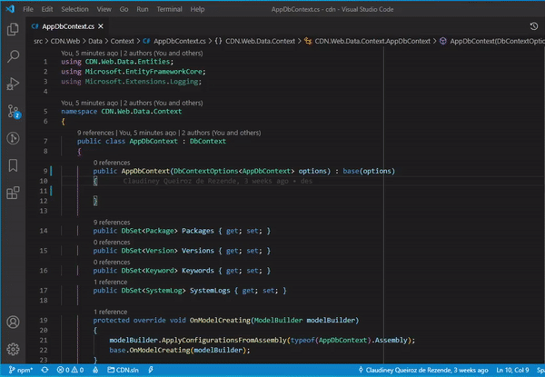
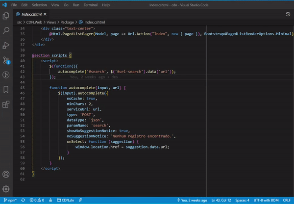

# Snippets Creator

Create snippets quickly from selected code blocks.

Automate the creation of snippets with this extension. Simply save code blocks as snippet.

You can edit created snippet as usual.

## Features

## Release Notes

### 1.0.2

- Improvements to PHP Language
- Optional Name Snippet

### 1.0.0

- Initial release

## License

MIT
